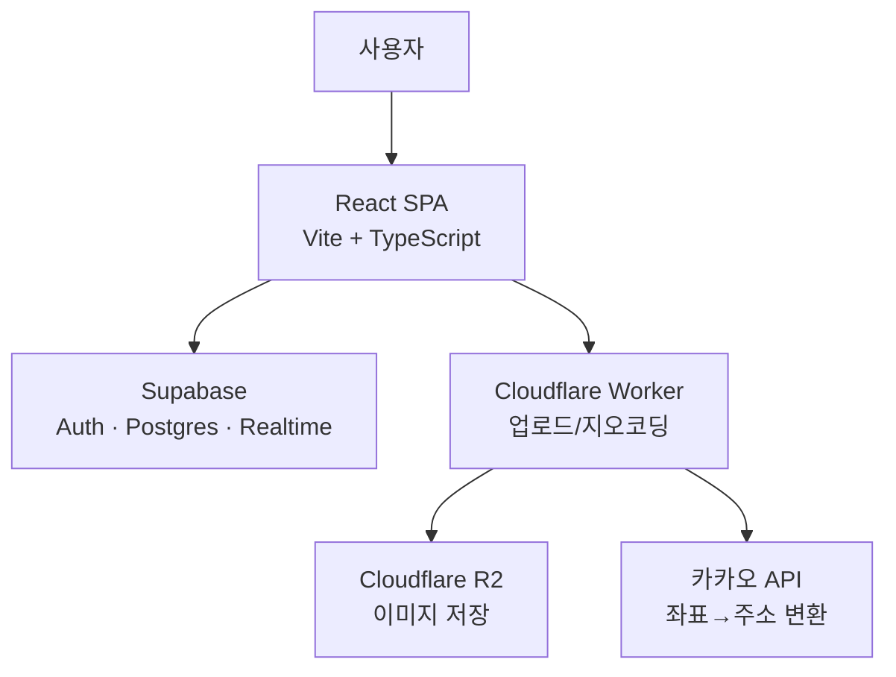

# 나누리 (Nanuri) – 청년부 비용 청구서 작성 앱

교회 청년부의 비용 청구, 행사 운영, 찬양팀 일정 공유를 한 곳에서 처리하는 모바일 웹 애플리케이션입니다. 멤버는 영수증을 찍어 비용을 청구하고, 임원진은 행사 타임라인을 구성해 참여자 평가를 받습니다.

개발 문서는 [docs/](docs/)에 있습니다. 구조·라우팅·데이터 모델·코드 규칙·진행 상태를 나눠 정리했습니다.

## 주요 기능

### 1. 영수증 비용 청구
멤버가 영수증 사진과 함께 비용을 청구합니다(`/member/bill`). 이미지는 업로드 전 클라이언트에서 압축(`browser-image-compression`)한 뒤 Cloudflare Worker를 거쳐 R2에 저장되고, 청구 내역에는 공개 URL이 기록됩니다.

### 2. 행사 운영 (타임라인 + 순서별 평가)
임원진이 행사와 순서를 구성하면(`/admin/events`) 참여자가 일정표로 보고(`/event/:id`), 각 순서를 익명으로 평가합니다(`/event/:id/timeline`). 평가는 Supabase Realtime으로 즉시 반영되며, 관리자가 결과 공개 여부를 정합니다.

순서는 절대 시각이 아니라 **소요 시간(분)** 으로 저장됩니다. 각 순서의 시작·종료 시각은 모이는 시각(`start_time`)부터 앞 순서들의 길이를 누적해 계산하므로, 순서를 재배치하거나 길이를 바꾸면 뒤 시각이 전부 따라옵니다.

### 3. 찬양팀 일정 공유
매주 주일 기준으로 인도자·싱어·피아노·어쿠스틱·베이스·일렉·드럼·PPT 등 포지션별 참여 가능 여부를 멤버가 직접 등록합니다. 같은 포지션에 중복 등록하면 교체 확인을 거치고, 변경 사항은 Realtime으로 실시간 반영됩니다.

### 공통
- **인증/권한**: Supabase Auth 기반. 멤버 전용 / 관리자 전용 라우트를 `ProtectedRoute`로 분리 제어하며, 실제 차단은 Postgres RLS가 담당합니다.
- **익명 닉네임 생성**: 랜덤 닉네임(형용사+동물+이모지) 자동 생성

### 개발 중 / 미연결
- **갤러리** — 준비 중 안내만 표시
- **회계 장부** — 거래내역 CSV 파싱과 카테고리별 집계 코드(`pages/accounting/`)는 있으나 **라우터에 연결돼 있지 않고, 이 코드가 쿼리하는 `accounting_*` 테이블도 DB에 없습니다**(현재는 `finance_*`). 되살리려면 테이블 이름부터 맞춰야 합니다
- **통계** — 라우트 제거됨

자세한 현황과 정리 대상은 [docs/status.md](docs/status.md)를 참고하세요.

## 기술 스택

| 영역 | 기술 |
| --- | --- |
| Frontend | React 19, TypeScript, Vite, Tailwind CSS 4 |
| 상태 관리 | Zustand (인증), TanStack Query (서버 데이터) |
| 폼 | React Hook Form (프로필 설정) |
| 라우팅 | React Router v7 |
| Backend / DB | Supabase (Auth, Postgres, Realtime) |
| 파일 저장 | Cloudflare Workers + R2 |
| UI | motion (애니메이션), lucide-react (아이콘), react-hot-toast, dnd-kit (행사 순서 정렬) |
| 이미지 | browser-image-compression |
| 배포 | Vercel (프론트엔드), Cloudflare Workers (업로드/지오코딩 API) |

`papaparse`(CSV 파싱)와 `@heroicons/react`는 미연결 상태인 회계 페이지에서만 사용합니다. `@anthropic-ai/sdk`와 `exifr`은 현재 어떤 코드에서도 쓰지 않습니다.

## 아키텍처



별도 백엔드 서버 없이 클라이언트가 Supabase와 Worker를 직접 호출합니다. 자세한 내용은 [docs/architecture.md](docs/architecture.md)에 있습니다.

## 프로젝트 구조

```
src/
├── components/          # 공용 컴포넌트 (Layout, ProtectedRoute, BottomNav, BackButton 등)
│   ├── nav/               # 하단 탭 캐릭터 아이콘
│   ├── ui/                # Button, TextField, SelectField, TextArea, ActionRow, MoodRating
│   └── worship/           # PositionSlot
├── constants/           # banks(은행 목록), theme(탭 색), worship(포지션 목록)
├── hooks/               # 도메인 훅
│   ├── useEvents.ts        # 행사 전반 (목록·상세·타임라인·결과)
│   ├── useWorshipSchedule.ts / useToggleAvailability.ts
│   ├── useReceiptUpload.ts  # 파일 선택 + 미리보기 수명 관리
│   ├── useCalendar.ts
│   └── useAccounting*.ts    # 회계 (미연결 페이지에서 사용)
├── lib/                 # 외부 연동 / 유틸리티
│   ├── supabase.ts         # Supabase 클라이언트
│   ├── supabaseList.ts     # 범용 목록 조회
│   ├── uploadReceipt.ts    # 이미지 압축 + Worker 업로드
│   ├── deleteImage.ts      # Worker 경유 R2 삭제
│   ├── eventTime.ts        # 타임라인 시각 계산
│   ├── eventStatus.ts      # 예정/진행 중/종료 판정
│   ├── eventColor.ts       # 행사 id → 팔레트 색
│   ├── mood.ts             # 3단계 만족도 정의·집계
│   └── generateNickname.ts # 익명 닉네임 생성
├── pages/
│   ├── auth/             # 게이트 / 멤버 로그인
│   ├── bill/             # 비용 청구 폼
│   ├── event/            # 행사 목록/정보/타임라인 (참여자)
│   ├── admin/            # 관리자 홈 + event/ 행사 관리
│   ├── worship/          # 찬양팀 일정
│   └── accounting/       # 회계 리포트 (라우터 미연결)
├── router/              # React Router 라우트 정의
├── store/               # Zustand 전역 상태 (인증)
└── types/               # event.ts, worship.ts

worker/                  # Cloudflare Worker (이미지 업로드/삭제, 역지오코딩 API)
supabase/migrations/     # 행사 관련 마이그레이션 (그 외 테이블은 미포함)
docs/                    # 개발 문서
```

## 시작하기

### 1. 의존성 설치

```bash
npm install
```

### 2. 환경 변수 설정

프로젝트 루트에 `.env` 파일을 생성하고 아래 값을 채워주세요.

```env
VITE_SUPABASE_URL=
VITE_SUPABASE_ANON_KEY=
VITE_CF_WORKER_URL=
```

### 3. 개발 서버 실행

```bash
npm run dev
```

### 4. 빌드 / 미리보기

```bash
npm run build    # tsc -b && vite build — 타입 에러가 있으면 실패합니다
npm run preview
npm run lint
```

## Cloudflare Worker

이미지 업로드/삭제와 역지오코딩을 담당하는 별도 백엔드입니다. `worker/wrangler.toml`을 환경에 맞게 설정한 뒤 배포합니다.

```bash
cd worker
npx wrangler deploy
```

필요한 바인딩/시크릿: `R2_BUCKET`, `R2_PUBLIC_URL`, `KAKAO_REST_API_KEY`. 엔드포인트 명세는 [docs/architecture.md](docs/architecture.md#cloudflare-worker-api)에 있습니다.

## 데이터베이스

`supabase/migrations/`에는 행사 관련 테이블만 있습니다. `user_profiles`, `bills`, `worship_*`, `accounting_*`은 원격 DB에만 존재하므로 이 저장소만으로는 스키마를 재현할 수 없습니다.

```bash
npx supabase db pull    # 원격 스키마를 마이그레이션으로 내려받기
```

테이블 구조와 RLS 정책은 [docs/data-model.md](docs/data-model.md)에 정리돼 있습니다.

## 배포

- 프론트엔드: Vercel (`vercel.json`에 SPA rewrite 설정 포함)
- API: Cloudflare Workers

## 라이선스

비공개 프로젝트입니다. (별도 라이선스 명시 전까지 무단 배포/사용을 금합니다.)
