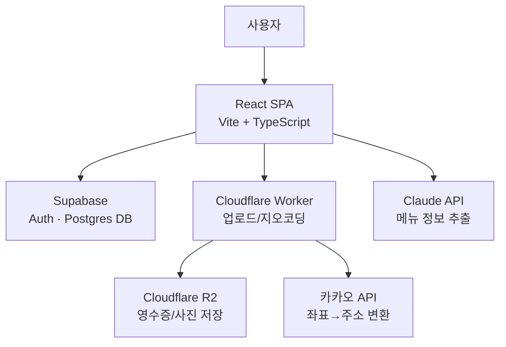

# 나누리 (Nanuri) – 청년부 비용 청구서 작성 앱

교회 청년부의 비용 청구·회계 장부 작성, 모임 장소 후보 메뉴 추출/투표, 찬양팀 일정 공유를 한 곳에서 처리하는 웹 애플리케이션입니다. 멤버는 영수증을 찍어 비용을 청구하고, 관리자(회계)는 거래내역 CSV를 업로드해 회계 장부를 작성합니다.

## 주요 기능

### 1. 영수증 비용 청구
멤버 본인 청구(`/member/form`)와 게스트 청구(`/guest/form`)를 분리 지원합니다. 영수증 이미지는 업로드 전 클라이언트에서 압축(`browser-image-compression`)한 뒤 Cloudflare Worker를 통해 R2에 저장됩니다.

### 2. 거래내역 파싱 및 회계 장부 작성
토스뱅크에서 내려받은 거래내역 CSV를 업로드하면 `papaparse`로 파싱해 거래 목록으로 변환합니다. 각 거래에 수입/지출 카테고리를 지정하면 카테고리별 합계와 잔액이 자동 계산되며, 회계 리포트로 저장해 기간별로 조회할 수 있습니다.

### 3. 메뉴판 이미지 → Claude API 메뉴 추출 (모임 장소 후보 투표)
모임 장소 후보를 등록할 때 메뉴판 사진을 올리면 Claude API(Anthropic SDK)가 이미지에서 메뉴 항목을 자동으로 추출해 종합해줍니다. 추출된 메뉴 정보와 함께 후보 장소를 비교하고 투표할 수 있습니다.

### 4. 찬양팀 일정 공유
매주 주일(일요일) 기준으로 인도자, 싱어, 피아노, 어쿠스틱, 베이스, 일렉, 드럼, PPT 등 포지션별 참여 가능 여부를 멤버가 직접 등록/확정합니다. 같은 포지션에 중복 등록 시 교체 확인 절차를 거치며, Supabase Realtime으로 변경 사항이 실시간 반영됩니다.

### 그 외: 행사 운영 (타임라인 + 순서별 평가) — 재구축 중
임원진이 행사 타임라인(순서별 시각·제목)을 구성하면 참여자가 일정표로 보고, 순서가 시작될 때 알림을 받으며, 각 순서를 진행 중에도/끝나고도 익명으로 평가할 수 있습니다. (기존 설문 기능을 대체하며 현재 개발 중)

### 공통
- **인증/권한**: Supabase Auth 기반, 멤버 전용 / 게스트 전용 / 관리자 전용 라우트를 `ProtectedRoute`로 분리 제어
- **익명 닉네임 생성**: 게스트용 랜덤 닉네임(형용사+동물+이모지) 자동 생성

## 기술 스택

| 영역 | 기술 |
| --- | --- |
| Frontend | React 19, TypeScript, Vite, Tailwind CSS 4 |
| 상태 관리 | Zustand |
| 데이터 패칭 | TanStack Query, React Hook Form |
| 라우팅 | React Router v7 |
| Backend / DB | Supabase (Auth, Postgres) |
| 파일 저장 | Cloudflare Workers + R2 |
| AI | Anthropic Claude API (메뉴 추출) |
| 기타 | exifr (EXIF 파싱), browser-image-compression, papaparse |
| 배포 | Vercel (프론트엔드), Cloudflare Workers (업로드/지오코딩 API) |

## 아키텍처



- **React SPA**: 클라이언트는 Supabase, Cloudflare Worker, Claude API와 각각 직접 통신
- **Cloudflare Worker**: 영수증/사진 파일은 R2에 저장하고, 좌표는 카카오 API로 주소 변환
- **배포**: 프론트엔드는 Vercel, Worker는 Cloudflare Workers에 별도 배포

## 프로젝트 구조

```
src/
├── components/        # 공용 컴포넌트 (Navbar, ProtectedRoute, LoadingScreen 등)
│   └── ui/             # 버튼, 인풋, 캐러셀 등 UI 프리미티브
├── hooks/              # 데이터 패칭/도메인 로직 커스텀 훅
│   ├── useAccountingCategories.ts
│   ├── useAccountingReport.ts
│   ├── useFormSubmit.ts
│   ├── useReceiptUpload.ts
│   └── useWorshipSchedule.ts
├── lib/                 # 외부 연동 / 유틸리티
│   ├── supabase.ts        # Supabase 클라이언트
│   ├── uploadReceipt.ts    # 영수증 압축 + Worker 업로드
│   ├── extractGps.ts       # 이미지 EXIF GPS 추출
│   ├── reverseGeocode.ts   # 좌표 → 주소 변환 (Worker 경유)
│   ├── extractMenus.ts     # Claude API로 메뉴판 이미지 → 메뉴 목록 추출
│   └── generateNickname.ts # 게스트 닉네임 생성
├── pages/
│   ├── auth/             # 로그인 / 게이트 페이지
│   ├── bill/             # 멤버/게스트 비용 청구 폼
│   ├── accounting/       # 회계 리포트 목록/상세/생성
│   ├── vote/             # 투표 목록/응답
│   └── worship/          # 찬양팀 일정
├── router/              # React Router 라우트 정의
└── store/               # Zustand 전역 상태 (인증)

worker/                  # Cloudflare Worker (영수증 업로드/삭제, 역지오코딩 API)
supabase/                 # Supabase 프로젝트 설정 (config.toml)
```

## 시작하기

### 1. 의존성 설치

```bash
npm install
```

### 2. 환경 변수 설정

프로젝트 루트에 `.env` 파일을 생성하고 아래 값을 채워주세요.

```env
VITE_SUPABASE_URL=
VITE_SUPABASE_ANON_KEY=
VITE_ANTHROPIC_API_KEY=
VITE_CF_WORKER_URL=
```

### 3. 개발 서버 실행

```bash
npm run dev
```

### 4. 빌드 / 미리보기

```bash
npm run build
npm run preview
```

## Cloudflare Worker

영수증 업로드/삭제와 역지오코딩을 담당하는 별도 백엔드입니다. `worker/wrangler.toml`을 환경에 맞게 설정한 뒤 배포합니다.

```bash
cd worker
npx wrangler deploy
```

## 배포

- 프론트엔드: Vercel (`vercel.json`에 SPA rewrite 설정 포함)
- API: Cloudflare Workers

## 라이선스

비공개 프로젝트입니다. (별도 라이선스 명시 전까지 무단 배포/사용을 금합니다.)
