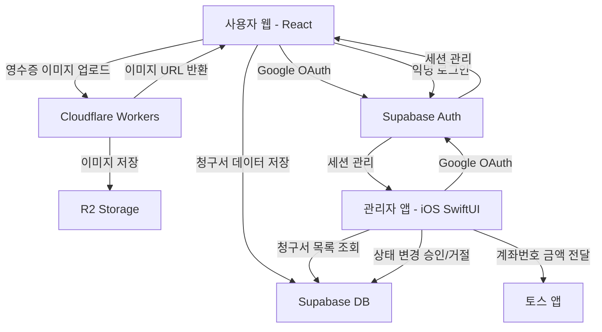

# 나누리 회계 앱

나누리 청년부 비용 청구서 작성 및 관리 시스템입니다.

## 소개

교회 구성원이 물품을 구입한 후 비용을 청구하고, 관리자가 이를 확인하여 토스로 송금하는 과정을 자동화한 앱입니다. 기존에 수작업으로 진행되던 회계 프로세스를 디지털화하여 청구 내역을 체계적으로 관리할 수 있습니다.

## 기술 스택

**Web (Frontend)**
- React + TypeScript
- Vite
- Tailwind CSS
- React Router DOM
- Zustand
- React Hook Form
- Supabase JS SDK

**Backend**
- Supabase (Auth, PostgreSQL Database, RLS)
- Cloudflare Workers + R2 (영수증 이미지 스토리지)

**Admin App (iOS)**
- Swift / SwiftUI
- Supabase Swift SDK
- Google Sign-In SDK

## 주요 기능

### 웹 (사용자)
- **교회 멤버 / 외부 방문자 구분 로그인**
  - 교회 멤버: Google OAuth 로그인 후 저장된 계좌 정보로 빠르게 청구
  - 외부 방문자: 익명 로그인으로 이름, 계좌 정보 직접 입력 후 청구
- **비용 청구서 작성**
  - 제목, 금액, 영수증 이미지 업로드
  - 은행 퀵 선택 메뉴로 간편하게 계좌 정보 입력
- **계좌 정보 관리**
  - 최초 등록 후 재사용 가능
  - 언제든지 수정 가능

### iOS 앱 (관리자)
- **Google 로그인 + Face ID 보안**
- **청구서 목록 조회**
  - 청구자 이름, 계좌, 금액, 영수증 확인
  - 대기중 / 송금완료 / 거절 상태 관리
- **토스 딥링크 송금**
  - 송금 버튼 클릭 시 토스 앱으로 자동 이동
  - 계좌번호, 금액 자동 입력
  - 송금 완료 후 앱으로 돌아오면 상태 처리

## 아키텍처

