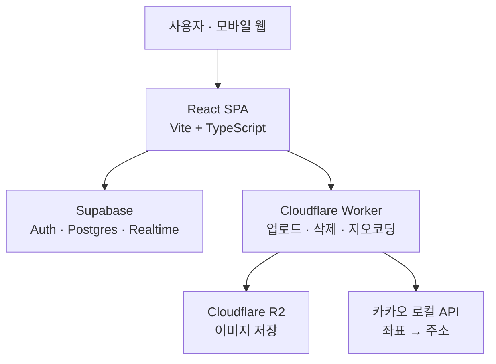

# 아키텍처

## 전체 구성



백엔드 서버가 따로 없는 **클라이언트 직결 구조**입니다. SPA가 Supabase와 Worker를 각각 직접 호출하고, 권한 제어는 라우터(UI)와 Postgres RLS(데이터) 두 겹으로 걸립니다. RLS가 실질적인 보안 경계이고 `ProtectedRoute`는 UX용 가드입니다. 자세한 정책은 [data-model.md](data-model.md)를 보세요.

## 외부 의존성

| 대상 | 용도 | 설정 |
| --- | --- | --- |
| Supabase | 인증(익명 로그인 포함), Postgres, Realtime 구독 | `VITE_SUPABASE_URL`, `VITE_SUPABASE_ANON_KEY` |
| Cloudflare Worker | R2 업로드/삭제, 카카오 역지오코딩 프록시 | `VITE_CF_WORKER_URL` |
| Cloudflare R2 | 영수증·포스터·배너 이미지 저장 | Worker 바인딩 `R2_BUCKET`, `R2_PUBLIC_URL` |
| 카카오 로컬 API | 좌표 → 주소 변환 | Worker 시크릿 `KAKAO_REST_API_KEY` |

## Cloudflare Worker API

`worker/src/index.js` 단일 파일이며 모든 응답에 `Access-Control-Allow-Origin: *`가 붙습니다.

| 메서드 | 경로 | 요청 | 응답 |
| --- | --- | --- | --- |
| `POST` | `/upload` | multipart: `file`, `folder`(기본 `receipts`) | `{ url }` — R2 공개 URL |
| `POST` | `/delete` | JSON: `{ receiptUrl }` | `{ success: true }` |
| `GET` | `/geocode` | 쿼리: `lat`, `lng` | `{ address, roadAddress, buildingName }` 또는 `null` |

업로드 키는 `${folder}/${crypto.randomUUID()}.${ext}` 형태로 생성되고, 삭제는 공개 URL에서 `R2_PUBLIC_URL` 접두사를 떼어내 키를 복원합니다. 인증 검사가 없으므로 URL을 아는 누구나 호출할 수 있습니다.

## 이미지 업로드 흐름

```
File 선택 → browser-image-compression (1MB / 1200px 이하)
         → POST {WORKER}/upload (multipart)
         → R2 저장 → 공개 URL 반환
         → Supabase 레코드에 URL 문자열로 저장
```

클라이언트 진입점은 `lib/uploadReceipt.ts`(업로드)와 `lib/deleteImage.ts`(삭제)입니다. 영수증뿐 아니라 행사 포스터·배너도 `folder` 인자만 바꿔 같은 함수를 씁니다. 압축 시 `exifOrientation: -1`로 회전 보정을 끕니다.

## 상태 관리

세 층으로 나뉩니다.

- **Zustand (`store/authStore.ts`)** — 세션·프로필 전역 상태. `initialize()`가 `main.tsx`에서 한 번 실행되어 `onAuthStateChange`를 구독하고, 구독 해제 함수를 반환합니다.
- **TanStack Query** — 서버 데이터 캐시. 소모임(`hooks/useGatherings.ts`·`hooks/useGatheringReviews.ts`), 찬양팀 일정(`hooks/useWorshipSchedule.ts`)이 사용하며, 쿼리 키는 도메인별로 `gatheringKeys`·`reviewKeys` 객체에 모아뒀습니다.
- **useState/useReducer** — 폼과 로컬 UI 상태.

Realtime 구독은 소모임(`gatherings` + `gathering_participants` + `gathering_reviews` + `gathering_review_likes`)과 찬양팀 참여 현황(`worship_availability`)입니다. 둘 다 이벤트 수신 시 Query 캐시를 무효화하는 방식입니다.

행사 결과(`segment_evaluations`) 구독은 평가 기능과 함께 폐기됐고, 테이블·퍼블리케이션도 2026-07-17 마이그레이션으로 DB 에서 지웠습니다([status.md](status.md)).

`staleTime`은 훅마다 다릅니다. `useGatherings`는 5분, `useGatheringReviews`도 5분입니다. 지정하지 않으면 기본값 0이라 마운트할 때마다 재조회하니, 캐시를 미리 채워 쓰는 개발 미리보기에서 주의하세요([status.md](status.md#화면-확인하는-법)).

## 폴더 구조

```
src/
├── components/          # 공용 컴포넌트
│   ├── nav/creatures.tsx  # 옛 탭바 캐릭터 SVG (지금은 DevPreviewPage 만 씀)
│   ├── ui/                # Button, TextField, TextArea, SelectField, ActionRow, BottomSheet
│   └── worship/           # PositionSlot
├── constants/           # banks(은행 목록), theme(Primary·Muted), layout(하단 여백), worship(포지션 목록)
├── hooks/               # 도메인 훅 (소모임·후기·찬양팀·영수증·캘린더)
├── lib/                 # supabase 클라이언트, 업로드/삭제, 소모임 시간·상태, 닉네임
├── pages/
│   ├── admin/             # 관리자 홈 (재정 관리 플레이스홀더뿐)
│   ├── auth/              # GatePage, MemberLoginPage
│   ├── bill/              # BillFormPage (비용 청구)
│   ├── dev/               # 개발 전용 UI 미리보기 (/__dev/*, 라우터 바깥)
│   ├── gathering/         # 소모임 목록 + 개설 시트 + 상세
│   └── worship/           # 찬양팀 일정
├── index.css            # @theme — 디자인 토큰 (docs/design.md)
├── router/index.tsx     # 라우트 정의
├── store/authStore.ts   # 인증 전역 상태
└── types/               # gathering.ts, worship.ts

worker/                  # Cloudflare Worker (업로드/삭제/지오코딩)
supabase/migrations/     # 행사·소모임·프로필 권한만 존재
```

## 빌드·배포

- 프론트엔드는 Vercel에 배포하며 `vercel.json`에 SPA rewrite가 있습니다.
- Worker는 `cd worker && npx wrangler deploy`로 별도 배포합니다.
- `npm run build`는 `tsc -b` 후 `vite build`라 **타입 에러가 있으면 빌드가 실패**합니다.
